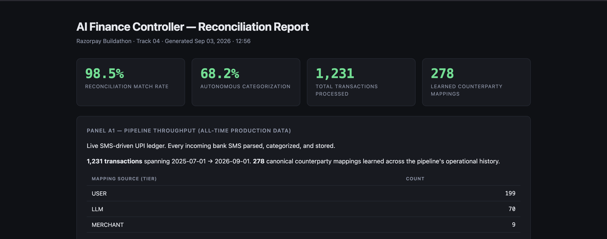
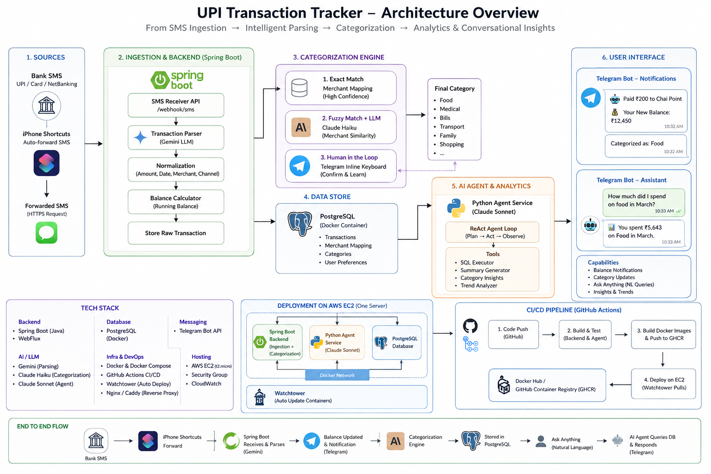

# AI Finance Controller

> Two-sided reconciliation controller for UPI-driven personal finance. Audits an SMS-ingested transaction ledger against the bank's authoritative monthly statements, using a multi-tier cascading categorization pipeline with confidence-scored exception routing.

**Razorpay Buildathon · Track 04 · September 2026**

---

## The result

Measured on live production data. No cherry-picking. Full methodology and itemized exception tables in the live report.

|   |   |
|---|---|
| **98.5%** | Reconciliation match rate on 16 days of live SMS pipeline operation (Aug 16–31, 2026) |
| **68.2%** | Autonomous categorization on 321 truly unseen counterparty rows (May + June + July 2026 statements) |
| **278** | Learned counterparty mappings accumulated across the pipeline's history |
| **0** | Real SMS pipeline drops on the reconciliation window |


### → [View the live report](https://ayushsharma0209.github.io/upi-transaction/)

Opens in your browser. All panels, all numbers, all exception tables. No cloning required.

### Video walkthrough

*5-minute pitch — link posted here on Sep 5.*

---

## What this does

Bank transactions arrive as SMS on my phone. iPhone Shortcuts forward each one to a Spring Boot backend on EC2, which parses it (regex + Gemini fallback for non-standard formats), updates a running balance, categorizes it through a multi-tier cascade, and persists it in PostgreSQL.

Every month, the bank generates a PDF statement — the authoritative source of truth. **The reconciliation controller compares that statement row-by-row against the SMS-derived ledger** using deterministic bucket matching on `(date, amount, direction, payment_method)`. Any mismatch is emitted as a scored exception with a reason code.

The goal, in Track 04's language: *"throughput plus measured accuracy plus an honest exception list."*

---

## Architecture



**Ingestion:** iPhone Shortcuts → Spring Boot webhook → SMS parser (regex + Gemini fallback) → Balance service → Categorization cascade → PostgreSQL.

**Categorization cascade (multi-tier, progressive cost):**
1. Exact match on raw counterparty ID (in-memory + DB lookup, ~9 ms)
2. Normalize (strip domain, digits, punctuation → uppercase)
3. Merchant allowlist (30-entry hardcoded map for global brands)
4. Claude Haiku picks from top-N or infers from name (~1090 ms)
5. Telegram HITL for uncertain cases (< 0.85 confidence) — user confirms in one tap, mapping learned permanently

**Reconciliation:** Bank statement PDF → `pdfplumber` parser → deterministic bucket matcher → exception classifier → HTML report generator.

**Query surface:** Claude Sonnet ReAct agent with SQL tools, exposed via a Telegram bot. Ask *"how much did I spend on food in March?"* in natural language.

Everything runs as Docker containers on a single AWS EC2 instance. CI via GitHub Actions builds and pushes images to GHCR; Watchtower auto-deploys.

---

## The measurement panels

| Panel | What it measures                                                                    | Data source |
|---|-------------------------------------------------------------------------------------|---|
| **A1** | Pipeline throughput and mapping-source distribution across all-time production data | Live PostgreSQL query on `transactions` + `counterparty_mappings` |
| **A2** | Categorization multi-tier distribution on truly unseen bank statement rows          | `POST /api/eval/categorize` batch run on May + June + July 2026 rows |
| **B** | Statement ↔ ledger match rate with itemized exception list                          | Deterministic bucket matcher on Aug 16–31, 2026 window |

Every panel populated from real production data. The [live report](https://ayushsharma0209.github.io/upi-transaction/) shows all three side-by-side with counts, percentages, and exception tables.

---

## The exception taxonomy

The reconciliation controller emits every unmatched row with a reason code:

| Code | Meaning |
|---|---|
| `MATCHED` | Same date, amount, direction, and payment method on both sides — deterministic pair |
| `STATEMENT_ONLY` | Bank has it, ledger doesn't — SMS pipeline drop, pre-go-live gap, or coverage boundary |
| `LEDGER_ONLY` | Ledger has it, bank doesn't — usually wallet-internal operations (e.g., Zomato refund + re-debit that never touch the bank) |

On the Aug 16–31 window: **67 MATCHED, 1 STATEMENT_ONLY** (pre-go-live boundary — SMS pipeline was deployed midway through Aug 16, so the earliest transaction that day predates ingestion), **2 LEDGER_ONLY** (Zomato wallet-internal ops that don't hit the bank statement).

Full itemized table in the [live report](https://ayushsharma0209.github.io/upi-transaction/).

---

## What's honest and what isn't

- **All quoted numbers are computed from real production data.** No cherry-picking, no synthetic amplification, no ex-post filtering.
- **Counterparty names** in exception tables are redacted for private individuals (family, friends). Public brand names (Zomato, Amazon, Netflix, Apple, IRCTC, etc.) are shown as-is.
- **The reconciliation window is 16 days** because the live SMS pipeline was deployed on Aug 16, 2026. Bank statement data before that date has no corresponding ledger to compare against — this coverage gap is a deliberate scope boundary, not a hidden limitation.
- **The 1 `STATEMENT_ONLY` exception** on Aug 16 is a pre-go-live boundary artifact (a transaction that occurred before the SMS pipeline was deployed that day), correctly flagged by the controller — not a pipeline defect.
- **Panel A2 numbers are one-shot.** Re-running the same evaluation against the same data would inflate the MAPPED multi-tier count because the pipeline learns during each run (Tier 5 LLM ≥0.85 hits auto-save a mapping). The 68.2% autonomous number represents a first-encounter measurement.
---

## Reproducibility

The [live report](https://ayushsharma0209.github.io/upi-transaction/) is the primary artifact for evaluation — everything is visible in-browser.

For deep verification, the reconciliation pipeline runs against synthetic sample data shipped in this repo:

```bash
git clone https://github.com/AyushSharma0209/upi-transaction.git
cd upi-transaction/reconciliation
pip install -r requirements.txt
python -c "from matcher import match; import csv, json; \
  stmt = [dict(r, amount=float(r['amount'])) for r in csv.DictReader(open('sample_data/kotak_sample.csv'))]; \
  ledger = [dict(r, amount=float(r['amount'])) for r in csv.DictReader(open('sample_data/ledger_sample.csv'))]; \
  print(json.dumps(match(stmt, ledger)['stats'], indent=2))"
```

Expected: `{ "matched": 13, "statement_only": 2, "ledger_only": 1, ... }`.

Individual scripts in `reconciliation/` also runnable standalone against your own Kotak-format PDFs — see [reconciliation/README.md](reconciliation/README.md).

---

## Tech stack

- **Backend:** Java 17, Spring Boot, WebFlux
- **Ledger:** PostgreSQL 16
- **Ingestion:** iPhone Shortcuts (SMS forwarder), Kotak Mahindra Bank SMS
- **LLMs:** Claude Haiku 4.5 (categorization), Claude Sonnet (conversational agent), Google Gemini (SMS parse fallback)
- **Reconciliation:** Python 3.10, `pdfplumber` (PDF parsing), `psycopg2` (Postgres)
- **Infra:** Docker Compose, AWS EC2, GitHub Container Registry, Watchtower auto-deploy, GitHub Actions CI
- **Query surface:** Claude Sonnet ReAct agent · Telegram Bot API

---

## Repo layout

```
upi-transaction/
├── src/                          Java Spring Boot backend
│   └── main/java/com/upi/transaction/
│       ├── controller/           SmsController, PendingController, EvalController
│       └── service/              CategorizationService (multi-tier cascade)
├── reconciliation/               Python — parser + matcher + report
│   ├── parse_unified.py          PDF → CSV (handles OLD + NEW Kotak formats)
│   ├── matcher.py                Deterministic bucket matcher
│   ├── run_reconciliation.py     CLI entry
│   ├── generate_report.py        HTML report generator
│   ├── eval_categorization.py    Panel A2 unseen-data replay
│   ├── sample_data/              Synthetic demo dataset (CSVs)
│   ├── requirements.txt
│   └── README.md
├── agent.py                      Sonnet ReAct agent (SQL tools)
├── agent_bot.py                  Telegram bot wrapper
├── docs/
│   ├── index.html                Live report (GitHub Pages source)
│   └── architecture.png          Architecture diagram
├── LICENSE
└── README.md
```

---

## Contact

**Ayush Sharma** · [ayush.for.work3886@gmail.com](mailto:ayush.for.work3886@gmail.com) · [github.com/AyushSharma0209](https://github.com/AyushSharma0209)

The production system runs on my personal EC2 instance and processes my own UPI transactions in real time. This buildathon submission wraps the same reconciliation loop in a reproducible package for evaluation.

---

*Built for Razorpay Buildathon 2026 · Track 04 — AI Finance Controller.*